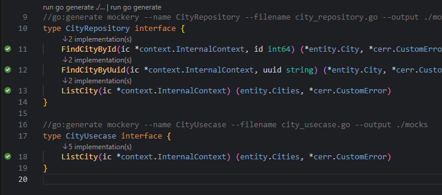
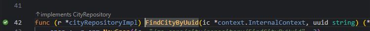

# Go Interface Detector

Go Interface Detector is a lightweight Visual Studio Code extension that brings the familiar GoLand-like gutter icons and CodeLens functionality to Go interfaces and their implementations. It provides a visual indicator to rapidly see which types implement which interfaces, along with robust bi-directional navigation.

<p align="center">
  
  &nbsp;&nbsp;
  
</p>

## Features

- **Gutter Icons**: Automatically displays a distinctive green check gutter icon next to interface methods and the receiver methods of structs that implement them.
- **CodeLens**: Adds "N implementation(s)" and "implements <Interface>" floating hints directly in your code.
- **Bi-Directional Navigation**: Navigate instantly from an interface to its implementing types, or vice versa, either using the built-in Peek panel or an interactive Quick Pick dropdown menu.

## Extension Settings

This extension contributes the following settings that can be customized in your user or workspace settings (`settings.json`):

* `goInterfaceDetector.navigationBehavior`: Determines how multiple target locations are displayed when navigating.
  * `"peek"` *(default)*: Opens the standard, inline VS Code Peek References panel showing all matches.
  * `"quickPick"`: Opens a compact, interactive VS Code Quick Pick dropdown showing the filename and line number, allowing for swift keyboard-driven navigation.

## Usage

When you open a Go file (`.go`):
1. Look for the gutter icons (green check marks) next to receiver methods that successfully satisfy an interface.
2. Click the `N implementation(s)` CodeLens above interface methods to see what structs implement them.
3. Click the `implements InterfaceName` CodeLens above a struct's receiver method to jump directly to the interface definition.

## Development & Building

To build the extension locally:
```bash
npm install
npm run compile
```

Press `F5` in VS Code to spawn a new Extension Development Host window with the extension loaded.
